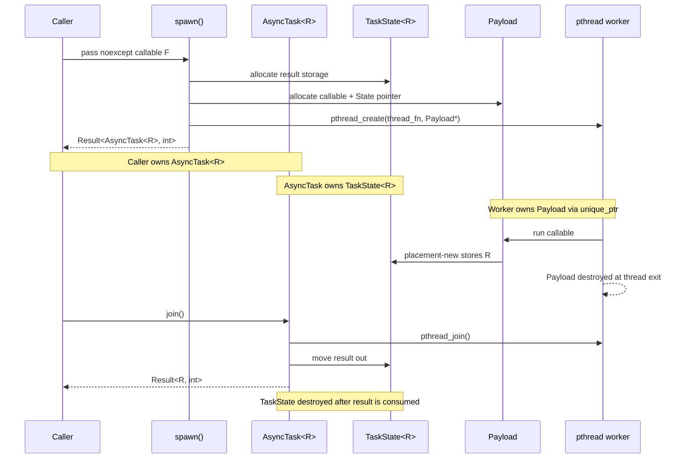

# pthread-async

Exception-free async tasks in C++17 using `pthread` + `Result<T,E>`.

## Build

```bash
cmake -S . -B build
cmake --build build
```

## Run

```bash
./build/main
```

## Test

```bash
cd build && ctest --output-on-failure
```

## Usage

```cpp
#include "async_task.hpp"

// spawn 返回 Result<AsyncTask<R>, int>
auto r = spawn([]() noexcept { return Result<int, std::string>::ok(42); });
if (!r) {
    std::cerr << "pthread_create failed: " << r.error() << "\n";
    return;
}
auto joined = r.value().join(); // pthread_join 后取任务结果
if (!joined) {
    std::cerr << "pthread_join failed: " << joined.error() << "\n";
    return;
}
auto result = std::move(joined).value();
```

## Architecture & Ownership



Ownership rules:

- `spawn()` allocates `TaskState<R>` and `Payload`. If allocation or `pthread_create` fails, it frees what it allocated and returns `Result::err(errno)`.
- After `pthread_create` succeeds, the worker thread owns `Payload`; `thread_fn` wraps it in `std::unique_ptr` and destroys it when the task exits.
- The returned `AsyncTask<R>` owns `TaskState<R>` and the joinable `pthread_t`.
- `AsyncTask::join()` calls `pthread_join()`, moves the stored result out of `TaskState<R>`, destroys `TaskState<R>`, and returns `Result<R, int>`.
- If an `AsyncTask<R>` is destroyed before `join()`, its destructor joins the thread and frees internal storage, but the task result is discarded.

```cpp
// Result<T,E> — 错误通过返回值传递，不使用异常
Result<int, std::string> safe_div(int a, int b) {
    if (b == 0) return Result<int, std::string>::err("division by zero");
    return Result<int, std::string>::ok(a / b);
}

auto r = safe_div(10, 0);
if (r) std::cout << r.value();
else   std::cerr << r.error();
```

## Constraints

- C++17，不使用 `std::thread`
- 不使用异常，错误一律通过 `Result` 返回
- 不引入第三方库
